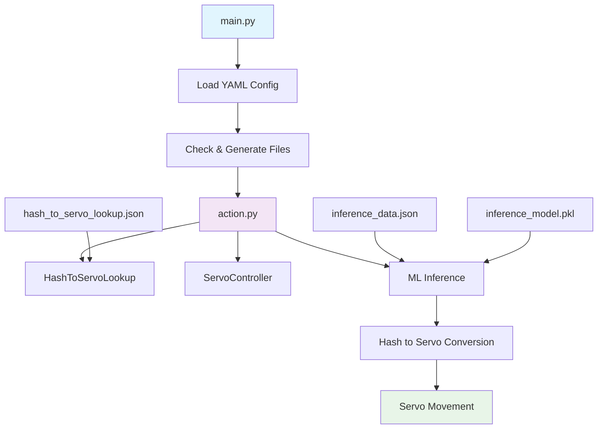
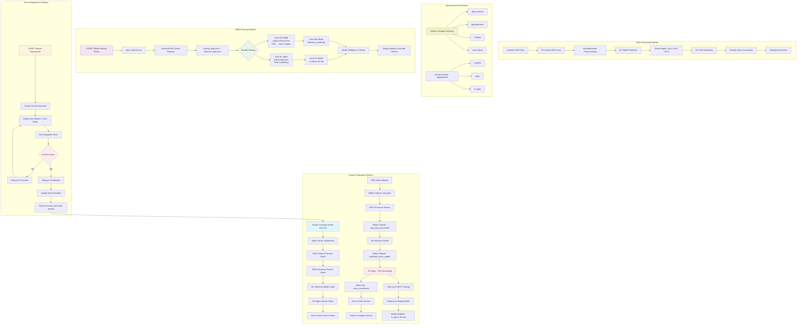

# Mechanicus

This is my space to explore the wonderful world of brain-computer interfaces. The majority of the decision making here assumes that you have
an EEG Headset (or EEG data) handy. Brain-waves are the main data source I am leveraging in this project.

So, essentially, the flow is:
EEG Headset captures brain waves -> ML Model interprets them -> software executes hardware movement based on ML model's interpretation

Initial PoC Data offered for free here: https://www.physionet.org/content/eegmmidb/1.0.0/S001/#files-panel
You can also generate your own.

I plan to expand the binary classifier to multi-class classifier for 3D movement in a cartesian plane, where the output is a hash value coorelating to spherical coordinates; exercised by a lookup algorithm.

I am still brainstorming how to create the prosthetic apparatus. I might need help in this area.

# Project Entry Point for Execution

The src/docker-compose.yml file is the main entry point for development and testing. Run this file with the command:

```bash
docker compose -f docker-compose.test.yml up --build
```

The src/docker-compose.offline_training.yml file will handle the orchestration for the Offline Training Pipeline (Lower Environments) Flow.

```bash
docker compose -f docker-compose.offline_training.yml up --build
```

The src/docker-compose.prod.yml file will handle the End User Runtime Flow (Production) Flow.

```bash
docker compose -f docker-compose.prod.yml up --build
```

# Current Architecture Overview

Your system has evolved from the POC to a microservice architecture:

**POC Approach** (deprecated):
- Single `main.py` entry point
- Hash-based servo lookup
- Monolithic structure


**Current Implementation**:
- Microservice architecture with Docker Compose
- Redis pub/sub communication
- Real-time RL path smoothing
- Containerized services


### Detailed Implementation Flow of Above

#### End User Runtime Flow (Production)


1. **Service Initialization**:
   - Redis server starts
   - Data Collector service initializes EEG data generation
   - EEG Processor service loads and starts monitoring
   - ML Inference Model loads `inference_model.pkl`
   - RL Agent loads `rl_agent_sb3.zip` model
   - Servo Driver initializes hardware connections

2. **Real-time Data Pipeline**:
   - EEG Data Collector → Redis Channel: `eeg_data`
   - EEG Processor consumes `eeg_data` → Redis Channel: `eeg_data_processed`  
   - ML Inference Model consumes `eeg_data_processed` → Redis Channel: `predicted_servo_angles`
   - RL Agent consumes `predicted_servo_angles` → Redis Key: `servo_commands`
   - Servo Driver executes commands from `servo_commands`

3. **Continuous Learning**:
   - RL Agent trains in real-time for path smoothing
   - Models auto-save periodically (when filesystem allows)
   - Each service logs performance metrics

## Offline Training Pipeline (Future Implementation)

1. **Data Generation**:
   - `data_collection.py` generates synthetic EEG datasets
   - Configurable servo position mappings
   - Training/validation data splits

2. **ML Model Training**:
   - Input: 64-channel EEG data (preprocessed)
   - Output: 3D servo angle predictions  
   - Algorithm: scikit-learn models or neural network
   - Save: `inference_model.pkl`

3. **Integration Testing**:
   - End-to-end pipeline validation
   - Redis communication testing
   - Hardware simulation

# Technology Stack

| Component | Technology | Purpose |
|-----------|------------|---------|
| Containers | Docker & docker-compose | Service orchestration |
| ML Framework | scikit-learn, TensorFlow | EEG classification and servo prediction |
| RL Framework | Stable Baselines3, Gymnasium | Path smoothing and movement optimization |
| Communication | Redis Pub/Sub | Inter-service messaging |
| Data Processing | pandas, numpy, StandardScaler | EEG signal processing |
| Hardware Interface | pyfirmata2, Arduino | Servo motor control |
| Model Storage | Shared Docker Volumes | Model persistence |
| Production | Kubernetes (K8s) - *Future* | Production orchestration |
| CI/CD | GitHub Actions - *Future* | Automated deployment |
| Monitoring | Container logs - *Future: Prometheus* | System monitoring |

# Redis Server Setup

```bash
sudo apt update
sudo apt install redis-server
```

**To start**: `sudo systemctl start redis` OR `redis-server`  
**To stop**: `sudo systemctl stop redis` OR `Ctrl + C`

**Important**: If Redis server is running before script execution, then docker compose up command will not execute properly. Run `sudo lsof -i :6379` to ensure Redis is not running before starting containers.

# Troubleshooting

## Common Issues

### Redis Connection Issues
```bash
# Check if Redis is running
sudo lsof -i :6379

# Start Redis if needed
sudo systemctl start redis
```

### Model Loading Issues
- Ensure model files exist in `/app/shared/models/`
- Check file permissions for shared volumes
- Models are created automatically if not found

### Container Volume Issues
```bash
# Create shared directory if it doesn't exist
mkdir -p ./shared/models
mkdir -p ./shared/data
mkdir -p ./shared/tb_logs
```

## Service Debugging

Enable debug logging by setting environment variable:
```bash
PYTHONPATH=/app LOG_LEVEL=DEBUG docker compose -f src/docker-compose.yml up
```

# RL Training Strategies

## Current Strategy: Real-time Path Smoothing
- RL Agent specializes in smooth movement generation
- DDPG algorithm with experience replay
- Online learning from servo movement data
- Reward based on distance to target + movement smoothness

## Future Training Alternatives
1. **Cross-Training Strategy**: Train on multiple movement patterns
2. **Evolutionary Training**: Population-based approach with selection
3. **Curriculum Learning**: Progressive difficulty training
4. **Ensemble Training**: Multiple agents with performance selection

This reduces training variance and improves movement reliability.