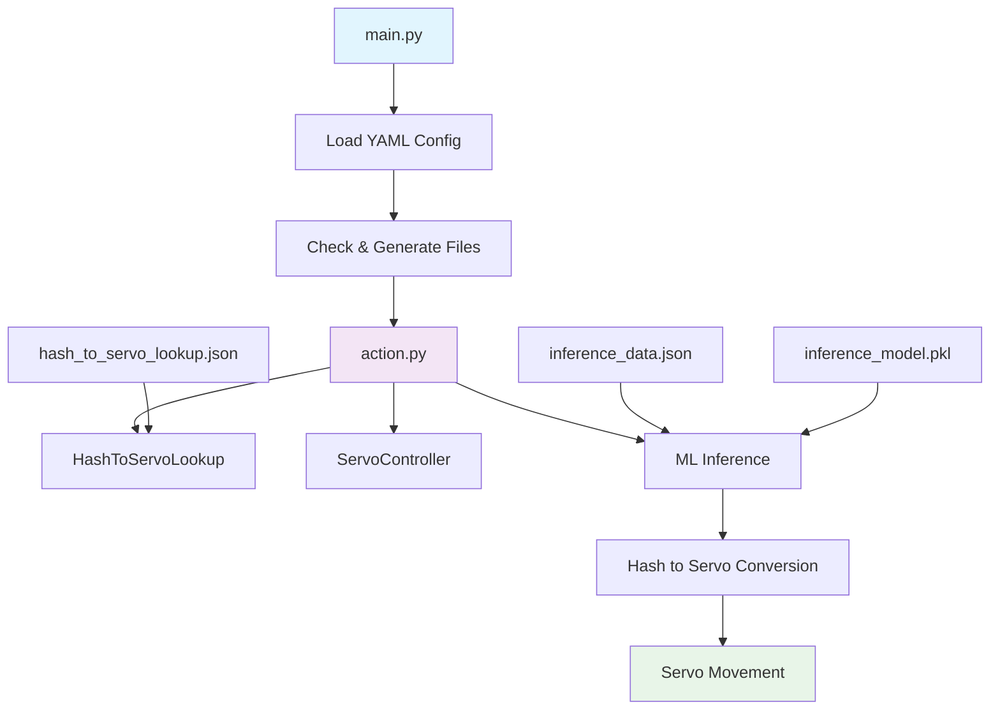

# mechanicus

This is my space to explore the wonderful world of brain-computer interfaces. The majority of the decision making here assumes that you have
an EEG Headset (or EEG data) handy. Brain-waves are the main data source I am leveraging in this project.

So, essentially, the flow is:
EEG Headset captures brain waves -> ML Model interprets them -> software executes hardware movement based on ML model's interpretation

Initial PoC Data offered for free here: https://www.physionet.org/content/eegmmidb/1.0.0/S001/#files-panel
You can also generate your own.

I plan to expand the binary classifier to multi-class classifier for 3D movement in a cartesian plane, where the output is a hash value coorelating to spherical coordinates; exercised by a lookup algorithm.

I am still brainstorming how to create the prosthetic apparatus. I might need help in this area.

# How to Use

Currently, the main way to run Mechanicus is by the following:

1. Activate your virtual environment, if you have one:
   Unix/Linux/MacOS:

```bash
source venv/bin/activate
```

Windows:

```bash
source venv/Scripts/activate
```

2. Then run the following

```bash
pip install requirements.txt
python main.py
```

# External Requirements

This project utilzes pyfirmata2, which requires the upload of StandardFirmata to the Arduino board. Please follow the tutorial in the URL below in order to get started before running any of this code:
https://github.com/berndporr/pyFirmata2?tab=readme-ov-file

# Logical Flow


