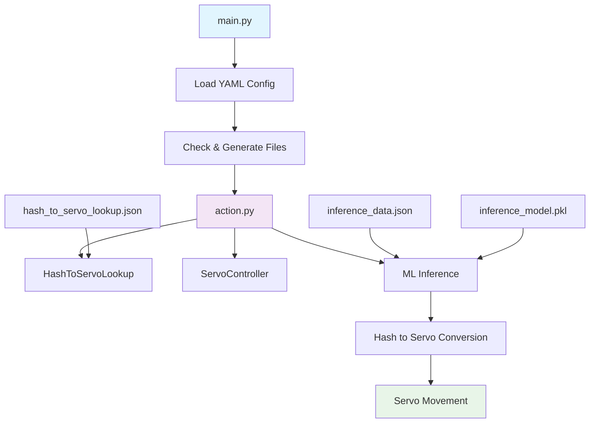
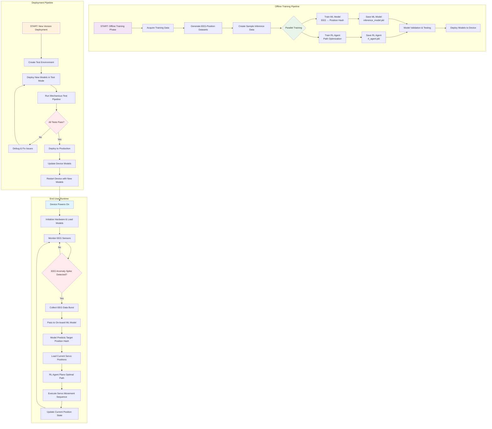

# mechanicus

This is my space to explore the wonderful world of brain-computer interfaces. The majority of the decision making here assumes that you have
an EEG Headset (or EEG data) handy. Brain-waves are the main data source I am leveraging in this project.

So, essentially, the flow is:
EEG Headset captures brain waves -> ML Model interprets them -> software executes hardware movement based on ML model's interpretation

Initial PoC Data offered for free here: https://www.physionet.org/content/eegmmidb/1.0.0/S001/#files-panel
You can also generate your own.

I plan to expand the binary classifier to multi-class classifier for 3D movement in a cartesian plane, where the output is a hash value coorelating to spherical coordinates; exercised by a lookup algorithm.

I am still brainstorming how to create the prosthetic apparatus. I might need help in this area.

# How to Use

Currently, the main way to run Mechanicus is by the following:

1. Activate your virtual environment, if you have one:
   Unix/Linux/MacOS:

```bash
source venv/bin/activate
```

Windows:

```bash
source venv/Scripts/activate
```

2. Then run the following

```bash
pip install requirements.txt
python main.py
```

# External Requirements

This project utilzes pyfirmata2, which requires the upload of StandardFirmata to the Arduino board. Please follow the tutorial in the URL below in order to get started before running any of this code:
https://github.com/berndporr/pyFirmata2?tab=readme-ov-file

# POC Logical Flow


# Desired End Result Logical Flow

### Detailed Implementation Flow of Above
#### End User Runtime Flow
1. Device Powers On:
   - Load mechanicus_run_configuration.yaml
   - Initialize servo controllers
   - Load inference_model.pkl & rl_agent.pkl
   - Calibrate EEG sensors

2. EEG Monitoring Loop:
   - Continuous sensor monitoring
   - Anomaly detection algorithms
   - Trigger on significant spikes

3. Action Execution:
   - EEG → ML Model → Position Hash
   - Current Position + Target Position → RL Agent
   - RL Agent → Optimal movement sequence
   - Execute servo movements
#### Offline Training Pipeline
1. Training Data Acquisition:
   - generate_hash_lookup.py → hash_to_servo_lookup.json
   - data_collection.py → training_data.json + inference_data.json
   - Real EEG data collection (optional)

2. Parallel Training:
   ML Model Training:
      - Input: EEG data features
      - Output: Position hash predictions
      - Algorithm: Random Forest/Neural Network
      - Save: inference_model.pkl
   
   RL Agent Training:
      - State: Current servo positions
      - Action: Servo angle adjustments
      - Reward: Smooth movement + target achievement
      - Algorithm: Q-Learning/PPO
      - Save: rl_agent.pkl

3. Validation:
   - Cross-validation on test datasets
   - Performance metrics collection
   - Integration testing
#### Deployment Pipeline
1. Test Environment:
   - test_mode: true in configuration
   - Simulated hardware interactions
   - Controlled test scenarios

2. Test Pipeline:
   - Unit tests for each component
   - Integration tests for full pipeline
   - Performance benchmarking
   - Safety validation

3. Production Deployment:
   - Model versioning and rollback capability
   - Gradual rollout strategy
   - Monitoring and logging
   - Remote update capability

# Key Components Still Needed for Implementation
# 1. EEG Anomaly Detection
src/eeg_monitor.py:
    - Real-time EEG data collection
    - Anomaly spike detection
    - Data preprocessing for ML model

# 2. Reinforcement Learning Agent
src/rl_agent.py:
    - Path planning from current to target position
    - Servo movement optimization
    - Training environment simulation

# 3. Device Runtime Controller
src/device_runtime.py:
    - Main runtime loop
    - EEG monitoring integration
    - Model coordination
    - Hardware control

# 4. Training Orchestrator
src/train_rl.py:
    - RL agent training pipeline
    - Environment simulation
    - Reward function definition

# 5. Deployment Manager
src/deployment.py:
    - Model versioning
    - Test pipeline execution
    - Production deployment
